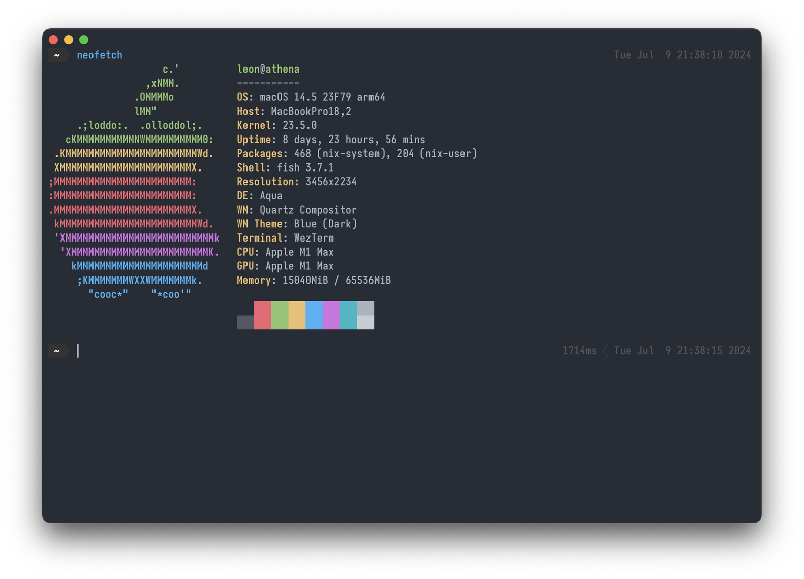
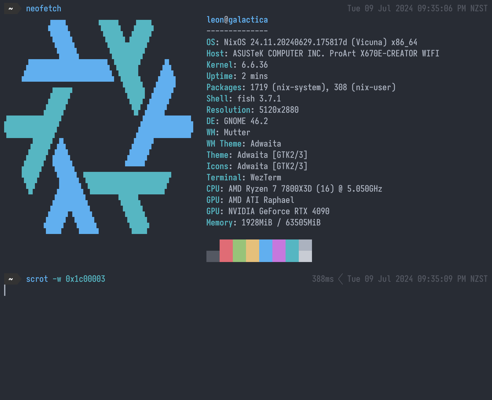

# Nix configuration

Inspired by [Dustin Lyons'](https://github.com/dustinlyons/nixos-config) repo.

Lets you have 99% the same command-line tools and configuration across macOS, Linux (nixOS)
and Windows (WSL).

See [Screenshots](#screenshots) for some pictures.

## Bootstrapping

You need to do this only once for a new machine.

### macOS

1. Install Nix using the [Determinate Systems](https://github.com/DeterminateSystems/nix-installer) Nix installer.

2. Install [Homebrew](https://brew.sh) (it's only used to install Casks and Mac App Store apps, its not in the `$PATH`).

3. Ensure that the current user is able to clone the private secrets repo before proceeding to the
   next step, by putting the SSH private key needed to clone the repo into `$HOME/.ssh/id_rsa`.

4. Run `env FLAKE=<NAME> ./bootstrap`. After a successful bootstrap, the hostname will be updated to match
   the flake.

5. Whenever you make configuration changes, run `./rebuild`. If any files are
   reported as being in the way, move them out of the way and re-run.

### WSL

1. Install and start up NixOS following the instructions in the
   [NixOS-WSL](https://github.com/nix-community/NixOS-WSL?tab=readme-ov-file)
   repository.

2. Run `sudo nix-channel --update` and `sudo nixos-rebuild switch` to set up the base system.

3. Run the below to enter a shell with `git` installed:

   ```shell
   export NIXPKGS_ALLOW_UNFREE=1
   nix-shell --impure -p git
   ```

4. Clone this repository to `/etc/nixos/nixos-config`.

5. Ensure the `root` user has the SSH public key for cloning the secret repository
   referenced by the `flake.nix`, it should be put in `/root/.ssh` with appropriate
   permissions. Run `ssh git@github.com` at least once, and save the GitHub SSH key
   (needed to avoid the `nixos-install` command hanging waiting for user input when
   cloning the secrets repo).

6. Change to `/etc/nixos/nixos-config` and run `env FLAKE=<NAME> ./rebuild` to do the initial build.
   Subsequent builds will not need you to specify the hostname.

7. To change the default user from being `root` (after failing to use `nixos`), run:

   ```sh
   sudo -E /run/current-system/sw/bin/nixos-rebuild boot --flake .#<NAME>
   ```

   Do **not** run `./rebuild` or `nixos-rebuild switch` after this!

8. Then exit the NixOS shell, and run `wsl -t NixOS` to stop it from running.

9. Run `wsl -d NixOS --user root exit`.

10. Stop the distribution again with `wsl -t NixOS`. Now when you next start it,
    it will use the user created by the flake.

### NixOS

1. Download the [latest NixOS stable distribution](https://nixos.org/manual/nixos/stable/index.html#sec-obtaining),
   these instructions were tested with 24.05. Download the minimal distribution, not graphical.

2. Create a [bootable USB](https://nixos.org/manual/nixos/stable/index.html#sec-booting-from-usb).

3. Boot from the USB device.

4. Create root and boot partitions and [format them with the file system of your choice](https://nixos.org/manual/nixos/stable/index.html#sec-installation-manual), use the _nixos_ and _swap_ labels, as our configuration depends on these labels, and mount the file systems in `/mnt` and `/mnt/boot`, respectively.

5. Run `nixos-generate-config --root /mnt`, and copy the generated `/etc/nixos/*.nix` files to $HOME.

6. Remove `/etc/nixos` directory entirely.

7. Clone this repository to `/mnt/etc/nixos`:

   ```shell
   export NIXPKGS_ALLOW_UNFREE=1
   nix-shell --impure -p git
   git clone https://github.com/leonbreedt/nix-config.git /mnt/etc/nixos
   ```

8. Move the generated `$HOME/hardware-configuration.nix` file to the `hw` subdirectory
   of `/mnt/etc/nixos` if not already there, and name it after the machine host name.

   Remember, this file contains the details of the partitions specific to this machine,
   as well as required kernel modules, which will be needed to rebuild the system while
   its hardware remains the same.

   Edit it if needed.
   Uncomment the explicit per-interface enablement for the interfaces you want to use DHCP.

   ```shell
   mv $HOME/hardware-configuration.nix /mnt/etc/nixos/hw/<HOSTNAME>.nix
   ```

9. Ensure the `root` user has the SSH public key for cloning the secret repository
   referenced by the `flake.nix`, it should be put in `/root/.ssh` with appropriate
   permissions. Run `ssh git@github.com` at least once, and save the GitHub SSH key
   (needed to avoid the `nixos-install` command hanging waiting for user input when
   cloning the secrets repo).

10. Create a script named `/root/git-askpass.sh` and put the below in it:

    `echo PASSWORD`

    Where PASSWORD is the passworf for the GitHub user. Make it executable with
    `chmod +x /root/git-askpass.sh`.

11. Run `export GIT_ASKPASS=/root/git-askpass.sh`

12. Run the installer in flake installation mode, where `<SYSTEM>` is the name of
    the system in `flake.nix`:

    ```shell
    nixos-install -v --impure --flake "/mnt/etc/nixos#<SYSTEM>"
    ```

    You will be prompted for a root password, which you can use after reboot to give
    the normal user a password to log in if you want to use X11. Only the normal user
    will be able to SSH in.

    Now you have a purely flake-based NixOS installation.

13. Whenever you make changes to the configuration, you can
    Run `env FLAKE=<SYSTEM> ./rebuild` in `/etc/nixos`, where
    `<SYSTEM>` is the name of the system in `flake.nix`. This will run `nixos-rebuild`
    in flake mode, and switch to the built configuration afterwards.

## Using

Whenever you make changes to the configuration, just run `./rebuild` in the cloned
flake directory to apply it to your system. Since the value of `FLAKE` defaults
to the current hostname, you don't have to pass a hostname for subsequent builds,
once it has been built once.

## Troubleshooting

There are still some rough edges with this configuration. Mainly around first-time
setup/retrieval of credentials from my private repo, you won't get access to it :)

If you remove the private repo input in `flake.nix` and the secrets references
you can likely get it going.

### Missing commands do not print derivations that resolve it

If you run a command that is not installed, and you get an error like this:

```shell
DBI connect('dbname=/nix/var/nix/profiles/per-user/root/channels/nixos/programs.sqlite','',...) failed:
unable to open database file at /run/current-system/sw/bin/command-not-found line 13.
```

Then you can likely resolve it by updating your Nix channels for the root user.

```shell
sudo nix-channel --update
```

### Rust completion doesn't work in VIM

Since are using `rustup` instead of global native Nix Rust packages, make
sure `rust-analyzer` is installed:

```shell
rustup component add rust-analyzer
```

## Screenshots

### macOS



### Linux



### WSL


